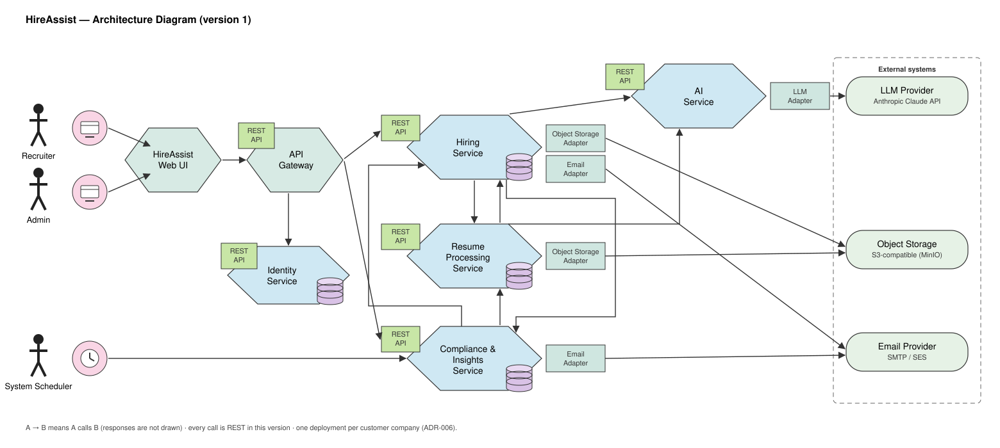

# Architecture Diagram — version 1

*Microservice Design with Collaborations.* This page is the diagram half of the deliverable; the
operations half is the [Service–Operations–Collaborators table](SERVICE-OPERATIONS-COLLABORATORS.md).
The two describe the same services and must agree — the table lists every operation, this page
shows who calls whom.

This is the first version of the architecture. It will be revised in later progress checkpoints;
what it must already do is show every component and operation the three core business use cases
need, end to end: **UC-1** create a job opening, **UC-2** batch-screen resumes, **UC-3** generate
interview questions.

*The diagram is a hand-laid SVG, **[diagrams/architecture-diagram.svg](diagrams/architecture-diagram.svg)**,
drawn in the style of the FTGO example used in the course. It is plain text: edit the labels,
boxes and arrows in the file directly and commit it — there is no separate source to re-render.*

---

## How to read it

- **An arrow `A → B` means "A calls B."** Responses are not drawn. Where a caller uses what it
  got from one call to make another, both arrows leave the caller — `A → B` and `A → C` — never a
  chain `A → B → C`, which would mean B calls C.
- **A plain line between a service and a data store means the service owns that store.** No
  service reads another service's store; it calls the owning service's operation instead.
- **Arrows are not labelled with operations** — the table lists them, and the traces below walk
  through each use case.
- **Every collaboration is REST over HTTP/JSON** — one protocol on every boundary (ADR-001).
  Screening is still asynchronous behind that: Hiring hands each resume over with a call that is
  acknowledged as soon as the work is durably recorded, and Resume Processing calls back with the
  result; the queue is a work table inside Resume Processing (ADR-002). A message broker and gRPC
  are deferred, not chosen — they will be revisited against the course's technology requirements
  in a later checkpoint.
- **External systems** sit on the right, outside the deployment boundary. Each is reached through
  an adapter inside the service that calls it, so no domain logic depends on a provider's API
  directly.
- **One deployment serves one customer company** (ADR-006). The dashed boundary is that
  deployment; there is no tenant identity anywhere inside it.

## Actors

| Actor | Initiates | Reaches the system through |
|---|---|---|
| **Recruiter** | UC-1, UC-2, UC-3, UC-4 | the HireAssist Web UI → API Gateway |
| **Admin** | everything a Recruiter can, plus UC-5 (retention policy) and UC-6 (members and roles) | the same UI — Admin specialises Recruiter |
| **System Scheduler** | UC-4 staleness checks and UC-5 retention evaluation, on a timer | calls Compliance & Insights directly; no UI |
| *Candidate* | nothing — an indirect actor with no interface | their resume arrives as a file the Recruiter uploads; not drawn |

Signing in (UC-0) is not a business use case. A Guest signs in through the gateway, which asks the
Identity Service to validate the session on every later request. The Identity Service is drawn
because the table lists it, but only the gateway calls it and it calls nothing. A request that
exceeds the caller's role is rejected at the gateway, which records the attempt by calling
Compliance & Insights (FR-0.4 — reject and record the rejected attempt).

## Services and what each owns

| Service | Business capability | Use cases | Owns (private store) |
|---|---|---|---|
| **API Gateway** | Single entry point: TLS, session validation, role check, rate limiting, routing | — | nothing |
| **Identity Service** | Who may sign in and with which role | UC-0, UC-6 | PostgreSQL — accounts, roles, sessions |
| **Hiring Service** | The hiring record: openings and criteria, screening batches and entry status, scores and overrides, shortlist decisions, interview guides | UC-1, UC-2, UC-3 | PostgreSQL — job openings, criteria, batches, scores, decisions; MongoDB — interview guides |
| **Resume Processing Service** | Turning one resume file into a scored candidate profile, and holding the candidate register | UC-2 (per-resume work) | MongoDB — candidate identity and collection date, candidate profiles, parsed text, scoring output and justifications; PostgreSQL — the screening work table |
| **AI Service** | Every call to the language model, behind three domain operations | UC-1, UC-2, UC-3 | nothing — prompts and the model credential only |
| **Compliance & Insights Service** | Retention enforcement, the pipeline dashboard, and the audit logs | UC-4, UC-5 | PostgreSQL — retention policy, pipeline metrics, erasure and access audit logs |

Resume files themselves live in object storage, written by Hiring when a batch is uploaded and
read by Resume Processing when it works; neither database holds them.

## The three business use cases, traced

The check the course asks for: *Actor → operation → responsible service → collaborators → where
the data lands.* Operation names are the table's.

**UC-1 — Create a job opening.** Recruiter → `createJobOpening()` on **Hiring**. Hiring →
**AI Service** `deriveCriteriaFromDescription()` → LLM Provider. Hiring returns the proposed
criteria; the Recruiter revises them (`reviseScreeningCriteria()`) and confirms. Hiring stores the
opening and its criteria in its PostgreSQL and calls **Compliance & Insights**
`recordPipelineEvent()`, from which the dashboard's view of open positions is maintained.

**UC-2 — Batch-screen resumes.** Recruiter → `submitScreeningBatch()` on **Hiring**. Hiring stores
each PDF in **Object Storage** (`storeResumeFile()`), creates the batch with one pending entry per
resume, and hands each resume to **Resume Processing** with `submitResumeForScreening()` — the
call carries a snapshot of the criteria and returns as soon as the work row is durably written —
then answers the Recruiter with the batch id. Resume Processing workers claim rows from their own
work table: fetch the file (`fetchResumeFile()`), extract the text and the profile in-process,
call **AI Service** `scoreAgainstCriteria()` → LLM Provider, store the profile and the scoring
output with its justification in their MongoDB, and call **Hiring** back with
`reportScreeningResult()`. Hiring records the score and must-have check against the batch entry in
its PostgreSQL and streams it to the ranked list (`getRankedResults()`); the written justification
stays in Resume Processing and is read with `getCandidateProfile()` when a candidate is opened.
When every entry is terminal, Hiring sends the batch-finished email through the **Email Provider**
(FR-2.12). The Recruiter overrides scores (`overrideScore()`) and shortlists
(`shortlistCandidate()`), all in Hiring.

**UC-3 — Generate interview questions.** Recruiter → `generateInterviewGuide()` on **Hiring** for a
shortlisted candidate. Hiring → **Resume Processing** `getCandidateProfile()` for the profile, then
→ **AI Service** `generateInterviewQuestions()` → LLM Provider. Hiring stores the guide in its
document store; the Recruiter revises it (`reviseGuide()`) and later records notes against it
(`recordInterviewNote()`).

**UC-4 and UC-5** follow the same pattern from the other side: the **System Scheduler** calls
**Compliance & Insights** `evaluateStaleness()` and `evaluateRetention()`; the dashboard is a
projection maintained from the `recordPipelineEvent()` calls Hiring makes; erasure is orchestrated
by Compliance calling `eraseHiringData()` on Hiring and `eraseCandidateProfile()` on Resume
Processing (FR-5.3), with the audit entry written in Compliance's own PostgreSQL (FR-5.5).

## Why one protocol

ADR-001 puts REST on every boundary — one wire format for four students to learn, readable in a
browser's network tab, debuggable without a client toolchain. The two boundaries that would have
argued for something else are served by REST anyway: the AI Service contract is held stable by an
OpenAPI document rather than a generated stub, and the long-running hand-off from Hiring to Resume
Processing is an acknowledged call plus a callback, with the retry, backoff and terminal-failure
behaviour living in Resume Processing's work table (ADR-002). Nothing about which service calls
which would change if a broker or gRPC were introduced later; only the arrows' wire format would.
