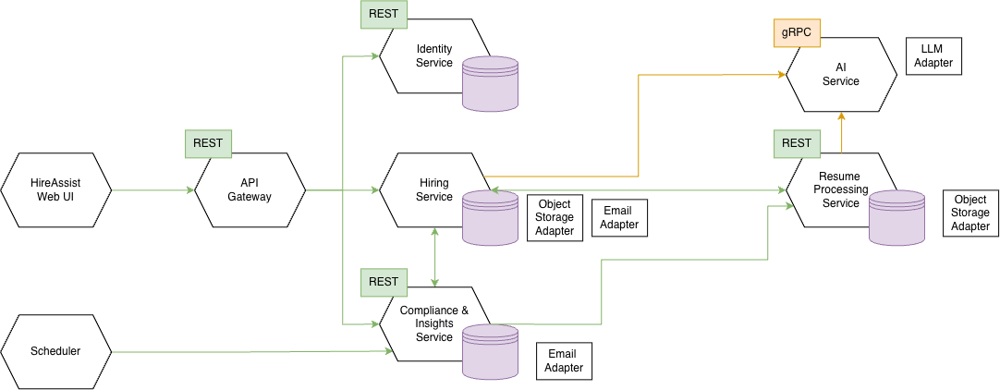

# Architecture Diagram — version 1

*Microservice Design with Collaborations.* This page is the diagram half of the deliverable; the
operations half is the [Service–Operations–Collaborators table](SERVICE-OPERATIONS-COLLABORATORS.md).
The two describe the same services and must agree — the table lists every operation, this page
shows who calls whom.

This is the first version of the architecture. It will be revised in later progress checkpoints;
what it must already do is show every component the three core business use cases need — **UC-1**
create a job opening, **UC-2** batch-screen resumes, **UC-3** generate interview questions — and
the collaborations between them.

*Drawn in draw.io. The `.drawio` source is kept outside this repository, so the PNG here cannot
be edited in place — change the source and export over it. This page and the
[Service–Operations–Collaborators table](SERVICE-OPERATIONS-COLLABORATORS.md) must agree with
what it shows.*

---

## How to read it

- **An arrow `A → B` means "A calls B."** Responses are not drawn. Where a caller uses what it
  got from one call to make another, both arrows leave the caller — `A → B` and `A → C` — never a
  chain `A → B → C`, which would mean B calls C.
- **A service's private store is drawn beside it**, and it is that service's alone. No service
  reads another service's store; it calls the owning service's operation instead.
- **Arrows are not labelled with operations** — the table lists them. **Every arrow is REST over
  HTTP/JSON except the two into the AI Service, which are gRPC** (ADR-001, ADR-007). There is no
  message broker anywhere in the picture.
- **An adapter box beside a service stands for an external system**, and for the fact that the
  service reaches it only through that adapter — object storage, the model provider, the email
  provider. The providers themselves are not drawn; the point the picture makes is that no
  domain logic touches a provider's API directly. The Service–Operations–Collaborators table
  names them.
- **The Scheduler is a trigger, not a service.** It is drawn because it is the only caller that
  does not arrive through the gateway, and because the erasure arrows out of Compliance &
  Insights would otherwise appear to fire from nowhere. How the timer is actually run is an open
  decision.
- **One deployment serves one customer company** (ADR-006), so everything in the picture is one
  company's instance and there is no tenant identity anywhere inside it.

## Actors

| Actor | Initiates | Reaches the system through |
|---|---|---|
| **Recruiter** | UC-1, UC-2, UC-3, UC-4 | the HireAssist Web UI → API Gateway |
| **Admin** | everything a Recruiter can, plus UC-5 (retention policy) and UC-6 (members and roles) | the same UI — Admin specialises Recruiter |
| **System Scheduler** | UC-4 staleness checks and UC-5 retention evaluation, on a timer | calls Compliance & Insights directly; no UI |
| *Candidate* | nothing — an indirect actor with no interface | their resume arrives as a file the Recruiter uploads; not drawn |

Signing in (UC-0) is not a business use case. A Guest signs in through the gateway, which asks the
Identity Service to validate the session on every later request. The Identity Service is drawn
because the table lists it, but it is connected only to the gateway — no other service calls it.

## Services and what each owns

| Service | Business capability | Use cases | Owns (private store) |
|---|---|---|---|
| **API Gateway** | Single entry point for user traffic: TLS, session validation, rate limiting, routing. The System Scheduler is an internal trigger and does not pass through it | — | nothing |
| **Identity Service** | Who may sign in and with which role | UC-0, UC-6 | PostgreSQL — accounts, memberships, roles, sessions |
| **Hiring Service** | The hiring record: openings and criteria, screening batches and their results, shortlist decisions, interview guides | UC-1, UC-2, UC-3 | PostgreSQL — job openings, criteria, batches and per-entry status, scores and overrides, shortlist decisions; MongoDB — interview guides |
| **Resume Processing Service** | Turning one resume file into a scored candidate profile | UC-2 (per-resume work) | PostgreSQL — the screening work table, candidate identity, collection date; MongoDB — candidate profiles, parsed text, per-criterion scoring output and justifications |
| **AI Service** | Every call to the language model, behind domain operations | UC-1, UC-2, UC-3 | nothing — prompts and the model credential only |
| **Compliance & Insights Service** | Retention enforcement and the pipeline dashboard | UC-4, UC-5 | PostgreSQL — retention policy, pipeline metrics, erasure and access audit logs |

Resume files themselves live in object storage, written by Hiring when a batch is uploaded and
read by Resume Processing when it works; neither database holds them.

## How the use cases run through it

This page stops at the picture: the components, what each owns, and who calls whom. The call
sequence behind every use case — actor, operation, responsible service, collaborators, and where
the data lands — is traced in **[OVERVIEW.md](OVERVIEW.md)**, including UC-0, UC-4, UC-5 and UC-6,
which the diagram touches but does not centre on.

They were traced in both places for a while, which is how the two drifted apart. One description
of runtime behaviour, one home for the diagram.

## Why REST everywhere except the AI Service

The reasoning behind one protocol was that boundaries are expensive to get wrong and protocols are
not. A boundary in the wrong place means re-owned data, a re-cut schema and a coordinated release;
a protocol in the wrong place is one adapter rewritten behind an interface that already exists. So
ADR-001 placed the boundaries first, ran them all over the protocol everybody on the team can
already debug, and named the AI Service call as the first place to revisit.

**That revisit has happened.** ADR-007 makes the AI Service gRPC, on three properties that separate
it from every other boundary: it carries the highest call volume in the system — once per resume,
not once per batch — its contract is the narrowest and least forgiving, and it is the boundary most
likely to be crossed by two different languages. Its operations are defined in a `.proto` and
both callers use a generated client, so a renamed field fails at build time rather than producing a
score with the justification quietly missing. The service is internal and never exposed through the
gateway, which is what makes a protocol nobody can read in a network tab acceptable here and
nowhere else.

**The message broker is still a known gap, and a deliberate one.** A spread of communication styles
is expected of us — at least one service reached by REST, one by RPC and one driven by a broker —
and two of the three are now delivered. ADR-001 recorded the shortfall as chosen rather than
overlooked, and the place the broker would earn its keep is already identified: the pipeline events
Hiring pushes synchronously into Compliance's write path, where a dropped call leaves a permanently
wrong dashboard number and nothing to reconcile against. Taking that step is its own record.
