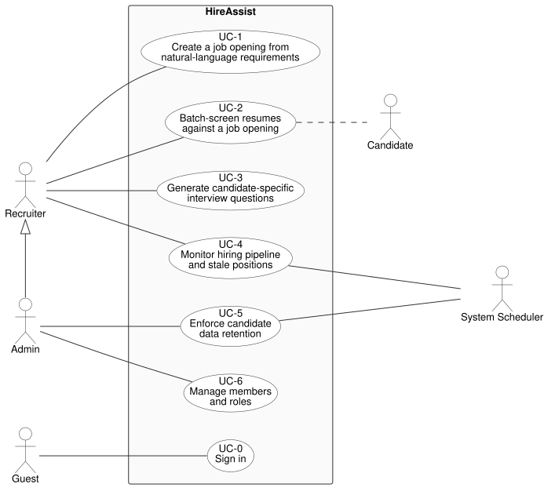

# HireAssist — Project Proposal

*Software Architecture — Term Project*

> **Status:** Draft 3 — Project Description, Use Cases, Functional and Non-functional
> Requirements, the use case diagram (UML, PlantUML source), and six ADRs — five accepted,
> ADR-005 proposed — complete.

---

## Project Name

**HireAssist** — an AI-assisted hiring-support layer for companies that receive more
applications than they can screen carefully and interview well.

> HireAssist is **not** a job board, **not** a job-application platform, and **not** another
> applicant-tracking system. It is an *assistant layer* that plugs into the hiring channels a
> company already uses and supplies the judgement capacity it lacks — screening every resume
> with a stated reason, preparing interview questions grounded in the specific resume and role,
> re-matching the existing talent pool, and keeping candidate data compliant.
>
> The human still decides. HireAssist makes sure they are deciding on evidence they actually
> had time to look at.

---

## Group Members

| # | Student ID | Name | Nickname |
|---|---|---|---|
| 1 | 6772055221 | Patiphon Puntusin | Me |
| 2 | 6872036421 | Thanabul Parodom | Tim |
| 3 | 6870406621 | Thanwarat Korcharoenkiat | Yo |
| 4 | 6870235621 | Rerngrit Jangsri | Frank |

---

## Problem Description

### The situation

Hiring is bursty. A position is posted on JobsDB, JobThai or LinkedIn, and applications
arrive in a concentrated wave into an email inbox or a spreadsheet. Every one of them
must be opened, read, and judged by hand — and then each surviving candidate must be
interviewed by someone who has actually studied their resume against the role.

The people doing that work are rarely dedicated to it. In a Thai tech SME it is a single
HR generalist who also owns payroll, admin and onboarding, or a founder or tech lead
hiring in between their actual job. In a larger company it is a small recruitment team
carrying many open roles at once. In both cases the same thing happens: applications
arrive faster than anyone can judge them properly.

### The core problem

> **บริษัทขนาดเล็กที่มีพนักงานไม่เพียงพอ ไม่สามารถ screen resume ได้ทัน**
>
> *Small companies with insufficient staff cannot screen incoming resumes fast enough.*

The decisive factor is not how many recruiters a company has — it is the **ratio between
the applications arriving and the capacity to judge them properly**. Screening effort
scales with applicant volume; screening capacity scales with headcount, and headcount
never keeps up. A company with one recruiter and 80 applicants and a company with five
recruiters and 2,000 applicants have the same problem.

When that ratio breaks, quality collapses in two places:

- **Screening becomes shallow.** Resumes get a 20-second skim, or are filtered on crude
  keyword matches. Good candidates are missed and weak ones advance.
- **Interviews become unprepared.** The interviewer opens the resume minutes beforehand
  and falls back on generic questions, so the interview fails to verify the very things
  screening could not confirm. An expensive hour produces little evidence.

### Consequences

| Consequence | Why it hurts |
|---|---|
| **Slow time-to-screen** | Strong candidates are interviewed and hired by a faster competitor before the SME even opens their file. |
| **Ghosted candidates** | With no time to reply, most applicants never hear back. This damages employer brand in a small, highly-networked local tech community. |
| **Unprepared, generic interviews** | With no time to study each resume against the role, interviewers ask the same stock questions of everyone. Claims on the resume go unprobed and gaps against must-have criteria go unverified, so the hiring decision rests on impression rather than evidence. |
| **No decision trail** | Rejections live in someone's head. When someone asks later "why did we pass on this person?", there is no answer, and no way to review whether screening is consistent or fair. |
| **The archive is dead weight** | Resumes from six months ago sit unused in a folder. When a similar role opens, the SME pays to source candidates all over again — including people who already applied and were a near-miss. |
| **Positions rot silently** | A requisition that has been open for 90 days looks exactly like one opened last week. Nobody is alerted, so nothing is re-scoped or re-posted. |
| **PDPA exposure** | Resumes are personal data under Thailand's PDPA. Storing them indefinitely in an inbox with no retention limit and no deletion process is a compliance risk that SMEs are least equipped to manage. |

### Why existing options do not solve it

- **Enterprise ATS** (Workday, Greenhouse, …) — built to *track* applications, not to judge
  them. They organise the queue, route approvals and store records, but a human still reads
  every resume and still walks into the interview unprepared. They are also priced and
  scoped for companies with a recruitment department.
- **Job boards** (JobsDB, JobThai, LinkedIn) — they solve *candidate supply*, and in doing so
  make the problem worse: they deliver more resumes into the inbox without helping anyone
  read them.
- **Keyword filters and CV parsers** — fast, but mechanical. They match strings rather than
  weighing evidence, cannot explain a decision, and reject good candidates for using
  different vocabulary.
- **Spreadsheets + inbox** — the current reality for most SMEs. Free, flexible, and exactly
  the thing that is failing.

### Our position

The gap is not candidate supply, and it is not record-keeping. It is **judgement capacity**
after the applications arrive — the ability to read every resume carefully and to interview
every shortlisted candidate on evidence rather than impression.

So HireAssist deliberately does **not** build another application funnel and does not try to
replace an ATS. It attaches to the channels a company already uses and adds the layer that is
missing: explainable screening at volume, interview questions grounded in the specific resume
and role, re-matching of the existing talent pool, visibility into stalling positions, and
personal data kept compliant.

The human still decides. HireAssist's job is to make sure that when they decide, they are
deciding on evidence they actually had time to look at.

---

## Target Customers

### Who qualifies

HireAssist's customer is defined by a **ratio, not by company size**:

> **Any company that receives more applications than it can screen carefully and
> interview well.**

Headcount is not the qualifier. A 20-person startup with one HR generalist and 80
applicants per opening, and a 300-person company with three recruiters and 2,000
applicants, are the same customer — both have more resumes than judgement-hours, and
both are losing quality at the same two points.

A company qualifies when **all** of the following hold:

| Qualifying condition | Why it matters |
|---|---|
| **Application volume exceeds screening capacity** | The core trigger. Resumes are skimmed, queued, or silently dropped because there are not enough hours to read them properly — regardless of how many people are doing the reading. |
| **Screening quality is judgement-based, not mechanical** | The role cannot be filtered by a single checkbox; it needs weighing of experience, skills and evidence. This is what makes an explainable AI score valuable rather than a keyword filter. |
| **Interviews are not systematically prepared** | Interviewers open the resume minutes beforehand. The company loses the chance to verify exactly what screening could not confirm. |
| **Roles recur or overlap** | Similar positions reopen over time, so past applicants retain value and the talent pool is worth re-matching instead of re-sourcing. |
| **No adequate ATS in place** | Hiring runs on inbox, spreadsheets, or a job board's built-in tooling — or on an ATS that stores applications without helping anyone judge them. |

A company **does not** qualify simply for being small. A 15-person company hiring one
person a year has no throughput problem and does not need HireAssist.

### Primary segment (initial focus)

Within that definition, we focus first on **Thai technology companies — software houses,
product startups, digital agencies and IT service firms, roughly 10 to 200 employees.**

| Attribute | Profile |
|---|---|
| Hiring pattern | Bursty and urgent — several roles at once, and the same roles reopen (e.g. "backend engineer" every few months) |
| Application volume | ~20–200 per opening, arriving in concentrated waves after a posting |
| Screening capacity | 0–2 HR generalists, often assisted by a tech lead hiring between their actual work |
| Existing tools | Email inbox, Google Sheets, LINE, one or two job boards; rarely a real ATS |
| Budget | Price-sensitive; will not pay enterprise ATS licensing |
| Languages | Mixed Thai and English resumes; job titles and technical skills mostly English |

**Why this segment first:** tech resumes are comparatively structured (skills, stacks,
years of experience, public repositories), which makes explainable matching tractable;
technical roles are exactly the case where a generic interview wastes the hour, so
resume-specific questions pay off immediately; roles recur, so the talent pool has value
from the first re-match; and these companies adopt SaaS tools readily.

This is a **beachhead, not a boundary.** Nothing in the design assumes a small company —
the same system serves a larger firm whose recruiters are equally outnumbered by
applicants. Larger organisations are a natural expansion once multi-team workflows and
deeper ATS integration are supported.

### Users of the system

| User | Goal | What they get from HireAssist |
|---|---|---|
| **Recruiter / HR** *(primary)* | Get through the application backlog, shortlist candidates who can be defended, and interview them well | Ranked, explainable shortlist instead of a folder of unread PDFs; interview questions grounded in that specific resume and role; alerts when a position is stalling; every decision and its reason recorded |
| **Admin / company owner** | Keep hiring compliant, consistent and auditable, and control who has access | Member and role management, data-retention settings, plus recorded rejection reasons and retention state for every candidate |
| **Candidate** *(indirect)* | Be judged on evidence, and have their data kept no longer than needed | A real reading rather than a 20-second skim; their data ages out of the system on a defined schedule, and an erasure request is honoured |

---

## Scenario (use-case & description)

### Overview

HireAssist is used by a small hiring team through one recruiter-facing web application.
The flow it supports end-to-end is:

> **describe the role → drop in the resumes → get an explained shortlist → walk into the
> interview prepared → and never lose the candidates you passed on.**

| ID | Use Case | Primary Actor | Solves (see *Consequences*) |
|---|---|---|---|
| UC-0 | Sign in | Guest | — (foundation) |
| UC-1 | Create a job opening from natural-language requirements | Recruiter | Slow time-to-screen |
| UC-2 | Batch-screen resumes against a job opening | Recruiter | Slow time-to-screen, ghosted candidates, no decision trail |
| UC-3 | Generate candidate-specific interview questions | Recruiter | Unprepared, generic interviews |
| UC-4 | Monitor hiring pipeline and stale positions | Recruiter | Positions rot silently |
| UC-5 | Enforce candidate data retention | System Scheduler / Admin | PDPA exposure |
| UC-6 | Manage members and roles | Admin | — (foundation) |

**Actors**

| Actor | Description |
|---|---|
| **Guest** | Anyone who has reached HireAssist but has not signed in. Primary actor of UC-0. On signing in they act as a **Recruiter** or an **Admin**, according to the role their account was given — so wherever these documents name a Recruiter or an Admin, that person is already signed in. |
| **Recruiter** | A signed-in member who runs day-to-day hiring — an HR generalist, a founder, or a tech lead hiring for their own team. Primary actor of UC-1 through UC-4: creates job openings, screens resumes, prepares interview questions, and monitors the pipeline. |
| **Admin** | The signed-in owner of the installation. Has every Recruiter capability, and additionally configures the data-retention policy (UC-5) and manages members and roles (UC-6). |
| **Candidate** | *Indirect actor.* Does not log in and has no interface in the system. Supplies the resume, and is the subject of the data processed. An erasure request from them arrives out of band, by email, and an Admin executes it (FR-5.7). |
| **System Scheduler** | *Supporting actor.* Time-driven trigger that runs work no human initiates: staleness checks (UC-4) and retention enforcement (UC-5). |

---

### UC-0 — Sign in

**Actor:** Guest
**Goal:** Prove who they are and enter the system with the permissions of their role.

**Description**

Every other use case operates on personal data, so all of them require an authenticated session;
this use case is the precondition for the rest. Its actor is a **Guest** — anyone who has reached
HireAssist but has not yet signed in. The Guest signs in and receives a session carrying their
**role**. From that moment they act as a
**Recruiter** or an **Admin**, according to that role, and every other use case is performed under
that identity. This is why the other use cases name Recruiter and Admin as their actors and need not
repeat the sign-in: being a Recruiter or an Admin already means being signed in.

Every request is checked against the role the session carries. Who may sign in, and with which
role, is decided by an Admin in UC-6.

**One deployment serves one company.** HireAssist is installed separately for each customer, so a
company's candidates are not merely hidden from other companies — they are not in the same system
at all. Isolation is a property of the deployment rather than something the code maintains
([ADR-006](adr/ADR-006-single-tenant-deployment.md)).

**There is no self-service route into the system.** HireAssist has no public sign-up and no
password-reset flow. The first Admin account is provisioned directly by the development team when
a company is onboarded, and every other account is created by that Admin in UC-6. A Guest is
therefore always someone who has already been given credentials — never a stranger creating an
account.

**Main flow**
1. Guest signs in with their email address and password.
2. System authenticates them and issues a session token carrying their role.
3. The user now acts as a Recruiter or an Admin, according to that role.
4. Every subsequent request is authorised at the gateway against that token.

**Alternate flows**
- *1a. Invalid credentials* — access denied and no session issued; the user remains a Guest.
- *4a. Token expired* — the session ends, and the user is prompted to sign in again as a Guest.
- *4b. Action exceeds the assigned role* — request rejected and the attempt recorded.

**Outcome:** Candidate data is accessible only to the right people in the right company, which is
both a security requirement and a PDPA obligation.

---

### UC-1 — Create a job opening from natural-language requirements

**Actor:** Recruiter
**Goal:** Turn the way a role is actually described in conversation into structured, machine-usable screening criteria — without filling in a long form.

**Precondition:** Recruiter is signed in (UC-0).

**Description**

Roles are rarely handed over as a formal specification. What the Recruiter is given sounds
closer to:
*"Backend engineer, 3+ years, Go or Python, must have actually shipped something with
Kafka or RabbitMQ, English good enough for a standup with our Singapore client, degree
doesn't matter."*

The Recruiter pastes exactly that into HireAssist. The system interprets it and proposes
a structured job opening: a title, and a set of criteria each marked as **must-have** or
**nice-to-have** with a weight. The Recruiter reviews the interpretation on screen — this
is the point where a human corrects the AI, not after 100 resumes have been mis-scored.
They can edit any criterion, change must-have vs nice-to-have, adjust weights, or add one
the AI missed. They also set an expected time-to-fill, which UC-4 later uses to decide
whether the position has gone stale.

On confirmation the job opening is saved in an **open** state, with the date it was opened
recorded, and becomes the target that UC-2 screens resumes against. From there the Recruiter
controls its lifecycle: an opening can be **paused** when hiring is put on hold — which also
suspends the staleness alerts in UC-4, so those alerts stay meaningful — **resumed**, or
**closed** with a recorded outcome — *filled* when someone is hired, *cancelled* when the role
is abandoned.

**Main flow**
1. Recruiter opens "New Job Opening" and pastes a free-text description (Thai or English).
2. System extracts a proposed title and a weighted, categorised criteria set.
3. System displays the proposed structure for review.
4. Recruiter edits criteria, weights, and must-have / nice-to-have flags.
5. Recruiter sets expected time-to-fill and confirms.
6. System stores the job opening as **open**, records the date it was opened, and reports the new opening to the pipeline dashboard.
7. Recruiter may later pause, resume, or close the job opening.

**Alternate flows**
- *2a. Description too vague to extract criteria* — system says which parts it could not
  interpret and asks the Recruiter to clarify or fill them in manually.
- *4a. Recruiter rejects the interpretation entirely* — they may discard it and enter
  criteria manually through the structured form.

**Outcome:** A job opening with explicit, weighted, reviewable screening criteria — created
in minutes from plain language, and traceable back to the words the role was described in.

---

### UC-2 — Batch-screen resumes against a job opening

**Actor:** Recruiter
**Goal:** Convert a pile of unread resumes into a ranked shortlist with a stated reason for every ranking.

**Precondition:** An open job opening exists (UC-1). Recruiter is authenticated.

**Description**

This is the use case that answers the core problem. The Recruiter selects an open position
and drops in a batch of resumes at once — the files that accumulated in the inbox, exported
from a job board, or dragged in as a folder — PDF, in Thai or English.

The system does not make the Recruiter wait on a spinner. It accepts the batch, returns a
batch identifier, and processes the resumes **asynchronously**: each resume is parsed into a
normalised candidate profile (contact details, work history, skills, education), then scored
against the job opening's weighted criteria. Because resumes are independent of one another,
they are processed concurrently, and the screen fills in progressively as results arrive.

Every result carries three things: a **score**, a **must-have check** (which mandatory
criteria are met or missed), and a short **written justification** citing the evidence in the
resume — *"6 years Go at two companies; Kafka used in production per the Wongnai role; no
evidence of English-language client work."* A score with no reason is not actionable by HR,
so explanation is a required output, not a feature.

Where a must-have criterion is not met the candidate is marked **not qualified**, recording
which criterion caused it. The ranked list can be filtered by minimum score or by an individual
criterion, so a Recruiter can ask "who actually has production Go?" without re-reading anything.
The Recruiter reviews the ranked list, overrides anything the AI got wrong, and **shortlists**
the people worth interviewing. Rejection is not a button anyone presses: a candidate who misses a
must-have is marked not qualified by the screening itself, and everyone else simply goes
un-shortlisted. The reason a candidate did not advance is therefore the same recorded
justification for every candidate, rather than a free-typed note that varies with whoever was
reviewing. That justification is **internal** — it gives the Recruiter and Admin an audit trail
and a consistency check, and is never sent to the Candidate.

Every screened candidate is added to the **talent pool**, recording the date their personal data
was collected — the fact UC-5 needs to enforce retention later. Consent to process the resume is
obtained before it reaches HireAssist, through whichever channel the candidate applied by; the
system records when the data arrived, not the consent itself. The pool is retained and governed
by UC-5, and is the foundation the deferred re-matching use case (D-1) will build on.

**Main flow**
1. Recruiter selects an open job opening and uploads a batch of resume files in PDF format.
2. System validates the files, rejecting any that are not PDF, creates a screening batch, and returns immediately with a batch ID.
3. System parses each resume into a normalised candidate profile.
4. System scores each profile against the job criteria and generates a justification.
5. System streams results into the ranked shortlist view as they complete, and notifies the Recruiter once the batch has finished processing.
6. Recruiter reviews the ranking, overrides any score the AI got wrong, and shortlists candidates.
7. System records each shortlist decision, and adds every candidate to the talent pool with the date their data was collected.

**Alternate flows**
- *3a. A file is unreadable* (corrupt, or a scanned image with no extractable text layer) —
  that resume is flagged for manual handling; the rest of the batch continues unaffected.
- *4a. The AI scoring service is unavailable* — affected resumes are retried; if they still
  fail they are marked *needs manual review* rather than silently scored zero.
- *6a. Recruiter disagrees with a score or a not-qualified mark* — they override it; the override
  is stored alongside the original AI score so screening quality can be reviewed later.

**Outcome:** A ranked, explained shortlist produced in one pass instead of hours of reading,
with every decision and its reason recorded, and every candidate retained in the talent pool.

---

### UC-3 — Generate candidate-specific interview questions

**Actor:** Recruiter
**Goal:** Walk into an interview with questions grounded in *this* candidate's resume and *this* job's requirements.

**Precondition:** The candidate has been screened and shortlisted for the job opening (UC-2).

**Description**

Screening produces a shortlist, but the interview is still improvised — whoever is interviewing
skims the resume five minutes beforehand and asks generic questions. HireAssist closes that gap.

For a shortlisted candidate, the system generates an interview guide from the **intersection
of the resume and the job opening**. Questions target three areas: claims in the resume worth
probing (*"You list Kafka on the Wongnai project — what was the partitioning strategy and why?"*),
**gaps against must-have criteria** that the interview needs to resolve (*"We need production
Go; your Go experience appears to be side projects — talk us through the largest one"*), and
role-specific depth drawn from the job criteria. Each question is tagged with the criterion it
tests and the resume evidence it came from, so the interviewer understands *why* it is being asked.

The Recruiter can regenerate, remove, or add questions. The guide is retained, so it can be
reopened before the interview rather than regenerated, and after the interview it can be used
to capture notes against each question, keeping evidence attached to the criterion it was meant
to test.

**Main flow**
1. Recruiter opens a shortlisted candidate and requests an interview guide.
2. System retrieves the Candidate profile, the original resume, and the job criteria.
3. System generates questions covering resume claims, must-have gaps, and role depth — each tagged with its source criterion.
4. System presents the guide grouped by theme.
5. Recruiter edits, removes, adds, or regenerates questions.
6. System retains the guide for retrieval before the interview.

**Alternate flows**
- *5a. Recruiter wants a different emphasis* (more system design, more behavioural) — they
  regenerate with that instruction.

**Outcome:** A per-candidate interview guide that tests exactly what screening could not verify,
prepared in seconds rather than skipped.

---

### UC-4 — Monitor hiring pipeline and stale positions

**Actors:** Recruiter (primary), System Scheduler (supporting)
**Goal:** See the health of every open position at a glance, and be told when one is stalling.

**Precondition:** At least one job opening exists.

**Description**

A requisition open for 90 days looks exactly like one opened last Tuesday. Nothing in an inbox
or spreadsheet raises a hand. The result is positions that quietly rot — never re-scoped, never
re-posted, never escalated.

The dashboard gives the Recruiter one view across all open positions: for each, the funnel
(**applied → screened → shortlisted**) and days open against the expected
time-to-fill set in UC-1. Seeing the two together is what makes a problem legible — a role with
200 applicants, one shortlist and 60 days on the clock has a criteria problem, not a supply
problem.

Independently of anyone opening the dashboard, the System Scheduler evaluates every open
position against its staleness rule and raises an alert when the position has been open longer
than its expected time-to-fill. Because that threshold is set per opening rather than once for
the whole company, a niche senior role and a fast-moving junior one are each judged against
their own realistic horizon. Alerts are delivered to the Recruiter responsible for the position,
and flagged positions are highlighted on the dashboard. The point is that noticing does not
depend on someone remembering to look.

**Main flow**
1. Recruiter opens the dashboard.
2. System aggregates pipeline metrics across all open positions.
3. System displays per-position funnels and days open vs. expected time-to-fill.
4. System highlights positions currently flagged as stale or blocked.
5. Recruiter drills into a position to see its candidates and act.

**System-triggered flow**
1. Scheduler periodically evaluates every open position against its staleness rule.
2. Positions breaching the rule are flagged and an alert is published.
3. The Recruiter responsible for the position is notified.
4. The flag is cleared when the position is closed, or the condition is resolved.

**Alternate flows**
- *4a. A position is deliberately paused* — it is excluded from staleness alerts while paused, so the alerts stay meaningful.

**Outcome:** Hiring problems become visible while they can still be fixed, and a stalled position
raises its own hand instead of waiting to be noticed.

---

### UC-5 — Enforce candidate data retention

**Actors:** System Scheduler (primary), Admin (configures the policy)
**Goal:** Make sure resumes and candidate data are not kept longer than the company is entitled to keep them — automatically, without anyone remembering to check.

**Preconditions:** A retention policy is configured. Candidate records exist in the talent pool.

**Description**

Under Thailand's PDPA, personal data may only be kept as long as the purpose it was
collected for requires. In practice this obligation is almost never met: resumes stay in
an inbox or a drive forever, because deleting them is nobody's job and nothing reminds
anyone that a file has aged past its purpose. The company accumulates an unbounded
archive of personal data it has no lawful basis to hold — and the more successful the
talent pool is, the larger that liability grows.

HireAssist makes retention a property of the system rather than a task someone forgets.
An **Admin** configures the retention policy: how long a Candidate's data may
be kept (for example 12 months), measured from a defined anchor — the date the data was
collected, or the Candidate's last activity in a hiring process. The Admin also chooses what
happens on expiry: **permanent deletion** of the resume and profile, or **anonymisation**,
which destroys all identifying data while preserving the aggregate counts the pipeline
dashboard (UC-4) is built from, so historical hiring metrics survive the erasure of the
person.

The **System Scheduler** then evaluates the talent pool on a recurring basis. Records
approaching expiry enter a **warning window**: the Recruiter is notified that a set of
candidates will expire on a given date. That is the moment to act on anyone still worth acting
on — move them forward in a live hiring process — because once the date passes they are gone.
Data is not kept longer simply because someone would like to keep it: under the PDPA it may be
held only as long as the purpose it was collected for requires, and wanting to look at a
candidate again later is a different purpose. Records that pass the expiry date
are removed or anonymised according to the policy — reaching every place the data is held, the
profile, the stored resume file, screening results and their justification text, and generated
interview guides, as one operation that leaves no partial record behind. Every action is written
to an **audit log** recording what was erased, when, and under which policy. That log is the
evidence the company can show a regulator, and it deliberately contains no personal data
itself.

Expired candidates disappear from the talent pool entirely, so no later feature can
surface them — this is the gate that any future re-matching (D-1) will depend on.
Candidates in an **active hiring process** are never silently deleted: they are held and flagged for the Recruiter to decide, because the purpose that
justifies keeping their data is still live.

**Main flow**
1. Admin configures the retention period, the anchor date, and the expiry action (delete or anonymise).
2. Scheduler periodically evaluates every candidate record against the policy.
3. Records entering the warning window are flagged, and the responsible Recruiter is notified with the list and the expiry date.
4. Recruiter acts on anyone still in play, or takes no action and allows expiry.
5. On the expiry date the system deletes or anonymises the record and everything derived from it, including stored resume files.
6. System writes an audit entry for each action and removes the Candidate from the talent pool.

**Alternate flows**
- *2a. Candidate is in an active hiring process* (shortlisted, scheduled, or awaiting a decision) — expiry is held and the record flagged for the Recruiter, since the original purpose is still active.
- *5a. A candidate requests deletion before expiry* — the request arrives by email, outside the system; an Admin executes the erasure immediately rather than waiting for the schedule.
- *5b. Deletion of a stored file fails* — the record is retained, the failure is logged and retried, and the record is reported as *deletion pending* rather than being marked erased.

**Outcome:** Candidate data ages out of the system on a defined schedule with an auditable
record of every erasure, so the talent pool stays lawful as it grows instead of becoming a
liability — and no one has to remember to do it.

---

### UC-6 — Manage members and roles

**Actor:** Admin
**Goal:** Control who has access to the system and what each member is allowed to do.

**Description**

Access to candidate data is a PDPA obligation as much as a security concern, so deciding who has
it belongs to one role. An Admin creates an account for a person and assigns them a role —
**Admin** or **Recruiter** — removes a member who should no longer have access, or changes a
member's role. Because there is no self-service sign-up, creating a member means creating their
account outright, with an initial password the Admin passes to them out of band. The role decides what that person may do once they sign in (UC-0): a Recruiter
creates job openings, screens resumes, prepares interview questions and monitors the pipeline,
while an Admin does all of that and additionally configures data retention (UC-5) and manages
access here.

This is a separate use case from signing in because it has a different actor and a different
goal. Every user authenticates, every session; managing access is an occasional administrative
task that only an Admin performs. Folding the two together hid the Admin's distinct responsibility
inside a use case that everyone participates in.

**Main flow**
1. Admin chooses to create a member account, remove a member, or change a member's role.
2. To create one, Admin enters the person's email address, sets an initial password, and assigns a role — Admin or Recruiter.
3. System applies the change to the membership list.
4. Admin passes the credentials to the new member outside the system.

**Alternate flows**
- *1a. A Recruiter attempts any of these actions* — the request is rejected and the attempt
  recorded, as for any action exceeding the assigned role (UC-0, 4b).

**Outcome:** Only the people the company chooses can reach its candidate data, each with exactly
the permissions of their role.

---

### Use Case Diagram

*The diagram is maintained as code in
**[diagrams/use-case-diagram.puml](diagrams/use-case-diagram.puml)** (PlantUML, standard UML use
case notation). The image above is rendered from that file; edit the source and re-render rather
than editing the image.*

**Relationships used, and why**

No «include» or «extend» relationships are used. Each use case here is a coherent unit of
behaviour that does not share a sub-behaviour with another, and factoring parts of a single use
case out purely to populate the diagram would add notation without adding meaning. Sub-steps such
as parsing a resume or scoring a profile are internal to UC-2 and are described in its flow, not
promoted to use cases in their own right.

No optional behaviour is conditionally added to any use case either, so there is nothing for an
«extend» to express. An earlier draft extended UC-2 with *Draft Interview Invitation Email*, but
no use case described that behaviour and no requirement backed it, so it was removed rather than
left in the diagram as a feature the rest of the proposal does not deliver.

*Notes:*
- *Authentication (UC-0) is a precondition of every other use case, and its actor is the
  **Guest**. A Guest who signs in acts as a **Recruiter** or an **Admin**, so those two actors
  always denote a signed-in user. That is why UC-0 is associated with the Guest alone, rather than
  drawn as six «include» arrows from every other use case, which would add clutter without adding
  meaning.*
- *No generalisation is drawn between **Guest** and **Recruiter** or **Admin**. Signing in changes
  the role a person plays; a Recruiter is not a kind of Guest.*
- ***Admin** specialises **Recruiter**, drawn as an actor generalisation arrow from Admin to
  Recruiter: an Admin inherits every Recruiter association (UC-1 to UC-4). Only Admin's own
  associations are drawn separately: configuring the retention policy (UC-5) and managing
  members and roles (UC-6). Repeating the inherited ones would add lines without adding meaning.*
- ***Candidate** is an indirect actor — they never log in and have no interface. They supply the
  resume that UC-2 processes, shown as a dashed association.*

---

### Deferred Use Cases

The following use case is **deliberately parked**. It is recorded here because it remains part of
the product's intended direction and shapes decisions we are making now — but it is out of scope
for the implementation delivered in this term project, and is not counted among the use cases
above or drawn in the use case diagram.

**Why it is deferred**

Re-matching is the most valuable idea in the original concept, and also the most dependent on
everything else working first. It cannot be demonstrated meaningfully until there is a talent pool
with real depth, which only exists after UC-2 has been used repeatedly over time; a re-match run
against an empty or shallow pool proves nothing. It also compounds risk: it multiplies scoring
cost across the whole archive, and it processes personal data for a purpose other than the one it
was collected for, which raises lawful-basis questions that UC-5 must be trusted to answer first.

**What we are doing now to keep it viable**

Deferring it is not abandoning it. The work already in scope is deliberately laid so that
re-matching can be added later without rework:

- UC-2 stores every screened candidate as a **normalised profile in the talent pool**, not merely
  as an attachment to one job opening — so the pool exists and grows from day one.
- Scoring is designed as a **separable behaviour** operating on *(profile, criteria)*, so it can be
  invoked over an archive rather than only over an incoming batch.
- UC-5 maintains the **retention state** that any lawful re-matching would have to respect, and
  removes expired candidates from the pool entirely.

**The parked use case, for the record**

#### D-1 — Re-match the talent pool against a job opening

**Actors:** Recruiter (primary), System Scheduler (supporting)
**Goal:** Surface strong candidates the company has *already* seen, instead of sourcing from zero every time.

**Preconditions:** A talent pool exists from previous screening (UC-2), governed by UC-5. An open job opening exists (UC-1).

**Description**

An SME's resume archive is its most under-used asset. The person who was a near-miss for
Backend Engineer in March may be an obvious yes for Platform Engineer in September — but
nobody remembers them, and nobody has time to re-read six months of PDFs.

Re-matching runs the *existing* talent pool against a job opening's criteria, reusing the same
scoring logic as UC-2. It can be triggered two ways:
**on demand / on job creation**, when a Recruiter opens a new position and immediately asks
"who do we already have?"; and **periodically**, when the System Scheduler re-evaluates open
positions against candidates added since the last run. *(Which of these is primary, and how it
is triggered, would be settled by an ADR if this use case is reinstated.)*

Because re-matching processes personal data collected for an *earlier* purpose, it is
**gated by retention**. Candidates whose retention period has expired are excluded from the pool —
they are never scored, and the Recruiter is told how many candidates were excluded on that ground
rather than being shown a silently shortened list. Whether an earlier application is a lawful
basis for matching against a later role is a question this deferred use case would have to answer
before it could be built.

Results arrive as a notification: *"7 candidates from your talent pool match Platform Engineer;
2 meet all must-haves."* From there the Recruiter treats them exactly like freshly screened
candidates — same ranked view, same explanations, same shortlist and rejection actions.

**Main flow**
1. Trigger fires — the Recruiter requests a re-match, or the System Scheduler initiates a periodic run.
2. System selects candidates from the talent pool that are within retention.
3. System scores each against the job opening's criteria (reusing UC-2's scoring behaviour).
4. System filters to matches above the relevance threshold.
5. System notifies the Recruiter with a summary of matches and the number of candidates excluded on retention grounds.
6. Recruiter opens the results, reviews the ranked matches with their explanations, and shortlists or dismisses each.

**Alternate flows**
- *2a. Pool is empty, or every candidate in it has expired* — the system reports this explicitly instead of returning "no matches".
- *4a. No candidate clears the threshold* — the Recruiter is told the pool was searched and nothing qualified, so a null result is still informative.
- *6a. A candidate requests deletion* — they are removed from the pool and excluded from all future re-matching.

**Outcome:** Qualified candidates the company already paid to attract are resurfaced automatically
and lawfully, turning a dead archive into a live sourcing channel.

---

## Functional Requirements

The full set of 44 functional requirements is maintained in
**[FUNCTIONAL-REQUIREMENTS.md](FUNCTIONAL-REQUIREMENTS.md)**, grouped by the use case each one
serves and numbered `FR-<use case>.<n>` for traceability.

| Use case | Requirements | Count |
|---|---|---|
| UC-0 Sign in | FR-0.1, FR-0.2, FR-0.3, FR-0.4 | 4 |
| UC-1 Create a job opening from natural-language requirements | FR-1.1 – FR-1.8 | 8 |
| UC-2 Batch-screen resumes against a job opening | FR-2.1 – FR-2.12 | 12 |
| UC-3 Generate candidate-specific interview questions | FR-3.1 – FR-3.5 | 5 |
| UC-4 Monitor hiring pipeline and stale positions | FR-4.1 – FR-4.4, FR-4.5, FR-4.6 | 6 |
| UC-5 Enforce candidate data retention | FR-5.1, FR-5.2, FR-5.3 – FR-5.5, FR-5.6 – FR-5.8 | 8 |
| UC-6 Manage members and roles | FR-6.1 | 1 |

The deferred use case D-1 has no functional requirements.

## Non-functional Requirements

The full set of 17 non-functional requirements is maintained in
**[NON-FUNCTIONAL-REQUIREMENTS.md](NON-FUNCTIONAL-REQUIREMENTS.md)**, grouped by the quality
attribute each one serves and paired with how it is verified.

| Quality attribute | Requirements | Concern |
|---|---|---|
| Performance | NFR-01 – NFR-05 | Parse, score, list and generate within stated bounds |
| **Scalability** | NFR-06 – NFR-08 | Batch throughput under an applicant burst — **the quality attribute this project demonstrates** |
| Availability & Reliability | NFR-09, NFR-10 | Uptime, and never losing an accepted resume |
| Security | NFR-11, NFR-12 | Encryption in transit and at rest; access audit |
| Privacy & Regulatory Compliance | NFR-13, NFR-14 | Erasure within 30 days; protected attributes excluded from scoring |
| Transparency | NFR-15 | Every score shows the per-criterion evidence behind it |
| Usability & Localisation | NFR-16 | Thai and English, desktop and tablet |
| Modifiability | NFR-17 | Scoring model and prompt change within one service boundary |

All figures are initial targets that give the architecture direction, to be revised once load
testing produces measured results. PDPA compliance is not stated as a single requirement because
it is not verifiable as one; it is the combined effect of NFR-12 to NFR-14 and the UC-5
retention requirements.

Five groups of these are architecturally significant and are each answered by an ADR — listed at
the end of [NON-FUNCTIONAL-REQUIREMENTS.md](NON-FUNCTIONAL-REQUIREMENTS.md).

## ADRs

Architecture Decision Records live in **[`adr/`](adr/)**, one decision per file, using the Jeff
Tyree & Art Akerman template described in [`adr/TEMPLATE.md`](adr/TEMPLATE.md). They are the
record itself — this section is only an index, so that a decision is stated in exactly one place
and cannot drift between a summary and the record it summarises.

| ID | Decision | Status |
|---|---|---|
| [ADR-001](adr/ADR-001-service-decomposition.md) | Capability-aligned service decomposition behind an API gateway — five services, REST on every boundary, and Kubernetes for service discovery | Accepted |
| [ADR-002](adr/ADR-002-async-screening-pipeline.md) | One independently retried unit of work per resume, held in a claimable work table — at-least-once delivery, idempotent results, classified retries, no message broker | Accepted |
| [ADR-003](adr/ADR-003-polyglot-persistence.md) | PostgreSQL as system of record, MongoDB for AI-derived documents, object storage for resume files | Accepted |
| [ADR-004](adr/ADR-004-llm-access.md) | All model access through one AI Service, on a managed API that does not train on our data | Accepted |
| [ADR-005](adr/ADR-005-per-service-language.md) | Each service chooses its own language and framework, within shared contracts | **Proposed** — languages await service ownership |
| [ADR-006](adr/ADR-006-single-tenant-deployment.md) | One deployment per customer company | Accepted |

They are best read in order: **ADR-001** draws the service boundaries, **ADR-002** fills in the
busiest one, **ADR-003** says what each side of those boundaries stores, and **ADR-004** fills in
the external dependency the other three are built to survive. **ADR-005** proposes how each
service's language is chosen and the contract and telemetry rules that would keep several
languages coherent — recorded as *Proposed*, because the languages themselves wait on service
ownership.

Each record carries its rejected alternatives, the argument, the negative implications, and the
mapping to the functional and non-functional requirements it serves.

Decisions identified but not yet taken are listed in [`adr/INDEX.md`](adr/INDEX.md) with the
requirement that forces each; open questions behind them are tracked in
[`CONTEXT.md`](CONTEXT.md).
